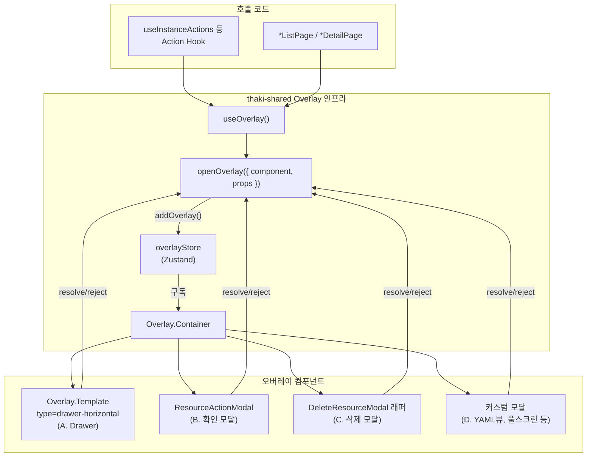

# thaki-ui 오버레이 인벤토리

> 작성일: 2026-04-16
> 대상 리포지토리: `ThakiCloud/thaki-ui` (develop 브랜치), `ThakiCloud/thaki-shared`

---

## 1. 개요

thaki-ui는 **드로어**, **확인 모달**, **삭제 모달**, **커스텀 모달** 등 모든 오버레이를 `thaki-shared`의 통합 Overlay 인프라 위에서 처리합니다. 별도의 라이브러리(react-modal 등) 없이, Zustand 스토어 기반의 Promise API로 오버레이의 열기/닫기/결과 반환을 일관되게 관리합니다.

### 4가지 오버레이 패턴


| 패턴                             | UI 형태                      | 코드 구조                                    | 용도                         |
| ------------------------------ | -------------------------- | ---------------------------------------- | -------------------------- |
| **A. Overlay.Template Drawer** | 우측 슬라이드 패널 (376px / 680px) | 별도 `*Drawer.tsx` 컴포넌트                    | 폼 입력이 필요한 생성/편집 액션         |
| **B. ResourceActionModal**     | 중앙 확인 모달                   | `@thaki/shared` 제공 (별도 파일 없음)            | 시작/정지/재부팅 등 단순 확인          |
| **C. DeleteResourceModal 래퍼**  | 중앙 삭제 모달 (대상 정보 표시)        | 별도 `*DeleteOverlay.tsx` 래퍼               | 리소스 삭제 확인                  |
| **D. 커스텀 모달**                  | 중앙 모달 (용도별 다양)             | `Overlay.Template type="modal"` 또는 독립 구현 | YAML 뷰, 풀스크린 차트, 비밀번호 확인 등 |


---

## 2. 아키텍처

### 2.1 핵심 컴포넌트 (thaki-shared)


| 파일                      | 역할                                                                                      |
| ----------------------- | --------------------------------------------------------------------------------------- |
| `Overlay.Template.tsx`  | UI 템플릿. `type` prop으로 drawer/modal 구분 (`drawer-horizontal`, `drawer-vertical`, `modal`) |
| `Overlay.Container.tsx` | 오버레이 라이프사이클 관리. Zustand 스토어 구독, 트랜지션, ESC 핸들링, 스크롤 잠금, Portal 렌더링                       |
| `Overlay.styles.ts`     | CVA 기반 스타일. drawer-horizontal sm(376px)/md(680px), 트랜지션(`translate-x-full`)             |
| `overlayStore.ts`       | Zustand 스토어. `overlays` 배열, `addOverlay`, `closeOverlayById`                            |
| `useOverlay.ts`         | Promise 기반 API. `openOverlay({ component, props })` → `await` 가능한 결과 반환                 |
| `ResourceActionModal`   | 단순 확인/경고 모달 프리셋                                                                         |
| `DeleteResourceModal`   | 삭제 전용 모달 프리셋 (대상 목록, 정보 아이템 표시)                                                         |


### 2.2 호출 흐름




### 2.3 Drawer 사이즈


| size prop | 너비    | 용도                               |
| --------- | ----- | -------------------------------- |
| `sm` (기본) | 376px | 단순 폼 (편집, 생성, 설정)                |
| `md`      | 680px | 복합 폼 (테이블 포함, 서브넷 생성, 보안그룹 관리 등) |


---

## 3. 패키지별 전체 현황

### 3.1 compute — Instances / Images / KeyPairs / ServerGroups

#### A. Overlay.Template 드로어 (16개)


| 파일                                  | 용도              | size | 호출 위치                                              |
| ----------------------------------- | --------------- | ---- | -------------------------------------------------- |
| `EditInstanceDrawer`                | 인스턴스 편집         | sm   | `useInstanceActions`                               |
| `CreateInstanceSnapshotDrawer`      | 인스턴스 스냅샷 생성     | sm   | `useInstanceActions`, `useInstanceSnapshotActions` |
| `RescueInstanceDrawer`              | 인스턴스 rescue 모드  | sm   | `useInstanceActions`, `useAdminInstanceActions`    |
| `AttachVolumeDrawer`                | 볼륨 연결 (인스턴스→볼륨) | sm   | `useInstanceActions`, `useVolumeActions`           |
| `DetachVolumeDrawer`                | 볼륨 분리           | sm   | `useInstanceActions`                               |
| `AttachInterfaceDrawer`             | 인터페이스 연결        | sm   | `useInstanceActions`                               |
| `DetachInterfaceDrawer`             | 인터페이스 분리        | sm   | `useInstanceActions`                               |
| `LockInstanceDrawer`                | 인스턴스 잠금 설정      | sm   | `useInstanceActions`                               |
| `RebuildInstanceDrawer`             | 인스턴스 재빌드        | sm   | `useInstanceActions`                               |
| `ManageSecurityGroupInstanceDrawer` | 보안 그룹 관리        | md   | `useInstanceActions`                               |
| `ResizeInstanceDrawer`              | 인스턴스 리사이즈       | sm   | `useInstanceActions`                               |
| `ManageTagsDrawer`                  | 태그 관리           | sm   | `useInstanceActions`                               |
| `EditImageDrawer`                   | 이미지 편집          | sm   | `useImageActions`                                  |
| `EditInstanceSnapshotDrawer`        | 스냅샷 편집          | sm   | `useInstanceSnapshotActions`                       |
| `CreateKeyPairDrawer`               | 키페어 생성/가져오기     | sm   | `KeyPairListPage`                                  |
| `CreateServerGroupDrawer`           | 서버 그룹 생성        | sm   | 직접 호출                                              |


#### B. ResourceActionModal 인라인 호출 (~10건)


| 호출 위치 (훅)                                 | 용도           |
| ----------------------------------------- | ------------ |
| `useInstanceActions` → stop               | 인스턴스 중지 확인   |
| `useInstanceActions` → start              | 인스턴스 시작 확인   |
| `useInstanceActions` → reboot             | 인스턴스 재부팅 확인  |
| `useInstanceActions` → pause/resume       | 일시정지/재개 확인   |
| `useInstanceActions` → unrescue           | Rescue 해제 확인 |
| `useImageActions` → delete                | 이미지 삭제 확인    |
| `useImageActions` → deactivate/activate   | 이미지 활성/비활성   |
| `useInstanceSnapshotActions` → delete     | 스냅샷 삭제       |
| `useInstanceSnapshotActions` → deactivate | 스냅샷 비활성      |
| `useServerGroupActions` → delete          | 서버 그룹 삭제     |


#### 관련 FIP 드로어 (network에서 import)


| 파일                             | 용도           |
| ------------------------------ | ------------ |
| `AssociateFIPtoInstanceDrawer` | 인스턴스에 FIP 연결 |
| `DisassociateFloatingIPDrawer` | FIP 연결 해제    |


---

### 3.2 compute — Storage (Volumes, Backups, Snapshots)

#### A. Overlay.Template 드로어 (17개)


| 파일                                 | 용도          | size |
| ---------------------------------- | ----------- | ---- |
| `CreateVolumeFromResourceDrawer`   | 리소스에서 볼륨 생성 | sm   |
| `EditVolumeDrawer`                 | 볼륨 편집       | sm   |
| `ExtendVolumeDrawer`               | 볼륨 확장       | sm   |
| `ChangeVolumeTypeDrawer`           | 볼륨 타입 변경    | sm   |
| `CreateVolumeSnapshotDrawer`       | 볼륨 스냅샷 생성   | sm   |
| `CreateVolumeBackupDrawer`         | 볼륨 백업 생성    | sm   |
| `RestoreVolumeSnapshotDrawer`      | 스냅샷 복원      | sm   |
| `CreateImageFromVolumeDrawer`      | 볼륨에서 이미지 생성 | sm   |
| `CreateTransferDrawer`             | 볼륨 전송 생성    | sm   |
| `AttachInstanceToVolumeDrawer`     | 볼륨에 인스턴스 연결 | sm   |
| `AcceptVolumeTransferDrawer`       | 볼륨 전송 수락    | sm   |
| `ToggleBootableDrawer`             | 부팅 가능 토글    | sm   |
| `DetachVolumeDrawer`               | 볼륨 분리       | sm   |
| `AttachVolumeDrawer`               | 볼륨 연결       | sm   |
| `EditVolumeSnapshotDrawer`         | 스냅샷 편집      | sm   |
| `EditVolumeBackupDrawer`           | 백업 편집       | sm   |
| `CreateVolumeBackupFromListDrawer` | 리스트에서 백업 생성 | sm   |


#### B. ResourceActionModal 인라인 호출 (4건)


| 호출 위치 (훅)                              | 용도        |
| -------------------------------------- | --------- |
| `useVolumeActions` → resetStatus       | 볼륨 상태 초기화 |
| `useVolumeActions` → forceDelete       | 강제 삭제     |
| `useVolumeBackupActions` → delete      | 백업 삭제     |
| `useVolumeBackupActions` → resetStatus | 백업 상태 초기화 |


#### D. 커스텀 삭제 모달 (2개)


| 파일                          | 용도     | 비고                                             |
| --------------------------- | ------ | ---------------------------------------------- |
| `VolumeDeleteModal`         | 볼륨 삭제  | `Overlay.Template type="modal"`, 연결된 스냅샷 체크 포함 |
| `VolumeSnapshotDeleteModal` | 스냅샷 삭제 | `Overlay.Template type="modal"`                |


---

### 3.3 compute — Network (Networks, Subnets, Routers, FIP, LB, SG)

#### A. Overlay.Template 드로어 (~38개)


| 파일                               | 용도                      | size |
| -------------------------------- | ----------------------- | ---- |
| `EditNetworkDrawer`              | 네트워크 편집                 | sm   |
| `SubnetDrawer`                   | 서브넷 생성/편집               | md   |
| `EditRouterDrawer`               | 라우터 편집                  | sm   |
| `CreateRouterDrawer`             | 라우터 생성                  | sm   |
| `ConnectSubnetDrawer`            | 서브넷 연결                  | sm   |
| `DisconnectSubnetDrawer`         | 서브넷 해제                  | sm   |
| `ManageExternalGatewayDrawer`    | 라우터 게이트웨이 관리            | md   |
| `CreateStaticRouteDrawer`        | 정적 라우트 생성               | sm   |
| `EditPortDrawer`                 | 포트 편집                   | sm   |
| `AttachPortToInstanceDrawer`     | 포트→인스턴스 연결              | sm   |
| `AttachToInstanceDrawer`         | 인스턴스 연결                 | sm   |
| `AllocateIPtoPortsDrawer`        | 포트에 IP 할당               | sm   |
| `CreateAllowedAddressPairDrawer` | Allowed Address Pair 생성 | sm   |
| `ManageSecurityGroupsDrawer`     | 보안 그룹 관리                | sm   |
| `AssociateFIPDrawer`             | FIP 연결 (범용, 탭 인터페이스)    | sm   |
| `AssociateFIPtoInstanceDrawer`   | FIP→인스턴스                | sm   |
| `AssociateFIPToLBDrawer`         | FIP→로드밸런서               | sm   |
| `AssociateFIPtoPortDrawer`       | FIP→포트                  | sm   |
| `AllocateFIPDrawer`              | FIP 할당                  | sm   |
| `EditFIPDrawer`                  | FIP 편집                  | sm   |
| `DeleteFIPDrawer`                | FIP 삭제                  | sm   |
| `DisassociateFIPDrawer`          | FIP 해제                  | sm   |
| `DisassociateFIPFromPortDrawer`  | 포트에서 FIP 해제             | sm   |
| `CreateSecurityGroupDrawer`      | 보안 그룹 생성                | sm   |
| `EditSecurityGroupDrawer`        | 보안 그룹 편집                | sm   |
| `CreateSGRuleDrawer`             | SG 규칙 생성                | sm   |
| `EditLoadBalancerDrawer`         | LB 편집                   | sm   |
| `EditListenerDrawer`             | 리스너 편집                  | sm   |
| `EditPoolDrawer`                 | 풀 편집                    | sm   |
| `EditMemberDrawer`               | 멤버 편집                   | sm   |
| `ManageLoadBalancerMemberDrawer` | LB 멤버 관리                | sm   |
| `HealthMonitorDrawer`            | 헬스 모니터 생성/편집            | sm   |
| `AddL7PolicyDrawer`              | L7 정책 추가                | sm   |
| `AddL7RuleDrawer`                | L7 규칙 추가                | sm   |
| `RegisterCertificateDrawer`      | 인증서 등록                  | sm   |
| `ChangeCACertificateDrawer`      | CA 인증서 변경               | sm   |
| `ChangeServerCertificateDrawer`  | 서버 인증서 변경               | sm   |
| `ManageSNICertificateDrawer`     | SNI 인증서 관리              | sm   |


#### D. 커스텀 삭제/확인 모달 (~20개)


| 파일                              | 용도                               |
| ------------------------------- | -------------------------------- |
| `NetworkDeleteModal`            | 네트워크 삭제 (DeleteResourceModal 래퍼) |
| `SubnetDeleteModal`             | 서브넷 삭제                           |
| `DeleteRouterModal`             | 라우터 삭제                           |
| `DeletePortModal`               | 포트 삭제                            |
| `SecurityGroupDeleteModal`      | 보안 그룹 삭제                         |
| `DeleteRuleModal`               | SG 규칙 삭제                         |
| `DeleteLBModal`                 | 로드밸런서 삭제                         |
| `DeleteListenerModal`           | 리스너 삭제                           |
| `DeletePoolModal`               | 풀 삭제                             |
| `HealthMonitorDeleteModal`      | 헬스 모니터 삭제                        |
| `DeleteL7PolicyModal`           | L7 정책 삭제                         |
| `DeleteL7RuleModal`             | L7 규칙 삭제                         |
| `DeleteCertificateModal`        | 인증서 삭제                           |
| `DeleteStaticRouteModal`        | 정적 라우트 삭제                        |
| `FloatingIPReleaseConfirmModal` | FIP 해제 확인                        |
| `ReleaseFIPModal`               | FIP 릴리즈                          |
| `DisassociateFIPFromLBModal`    | LB에서 FIP 해제                      |
| `DisassociateFIPFromPortModal`  | 포트에서 FIP 해제                      |
| `DetachInstanceModal`           | 인스턴스 분리                          |
| `ToggleSnatConfirmModal`        | SNAT 토글 확인                       |


---

### 3.4 compute — Admin (관리자 전용)

#### A. Overlay.Template 드로어 (~50개)


| 파일                                      | 용도              |
| --------------------------------------- | --------------- |
| `AdminEditInstanceDrawer`               | 관리자 인스턴스 편집     |
| `AdminLockInstanceDrawer`               | 관리자 인스턴스 잠금     |
| `AdminInstanceMigrateDrawer`            | 콜드 마이그레이션       |
| `AdminInstanceLiveMigrateDrawer`        | 라이브 마이그레이션      |
| `AdminEditImageDrawer`                  | 관리자 이미지 편집      |
| `AdminManageImageAccessDrawer`          | 이미지 접근 관리       |
| `AdminEditInstanceSnapshotDrawer`       | 관리자 스냅샷 편집      |
| `AdminFlavorAccessDrawer`               | 플레이버 접근 관리      |
| `AdminVolumeEditDrawer`                 | 관리자 볼륨 편집       |
| `AdminVolumeMigrateDrawer`              | 볼륨 마이그레이션       |
| `AdminVolumeUpdateStatusDrawer`         | 볼륨 상태 업데이트      |
| `AdminVolumeSnapshotUpdateStatusDrawer` | 스냅샷 상태 업데이트     |
| `AdminVolumeBackupUpdateStatusDrawer`   | 백업 상태 업데이트      |
| `EditVolumeTypeDrawer`                  | 볼륨 타입 편집        |
| `ManageQoSSpecDrawer`                   | QoS 스펙 관리       |
| `ManageVolumeTypesAccessDrawer`         | 볼륨 타입 접근 관리     |
| `CreateEncryptionDrawer`                | 암호화 생성          |
| `CreateVolumeTypeDrawer`                | 볼륨 타입 생성        |
| `CreateQoSPolicyDrawer`                 | QoS 정책 생성       |
| `CreateQoSSpecDrawer`                   | QoS 스펙 생성       |
| `CreateQoSSpecExtraSpecDrawer`          | QoS 스펙 추가 스펙 생성 |
| `CreateExtraSpecDrawer`                 | 추가 스펙 생성        |
| `EditExtraSpecDrawer`                   | 추가 스펙 편집        |
| `EditQoSPolicyDrawer`                   | QoS 정책 편집       |
| `EditQoSSpecExtraSpecDrawer`            | QoS 스펙 추가 스펙 편집 |
| `EditConsumerDrawer`                    | Consumer 편집     |
| `ManageBandwidthIngressRuleDrawer`      | QoS 대역폭 인그레스 규칙 |
| `ManageBandwidthEgressRuleDrawer`       | QoS 대역폭 이그레스 규칙 |
| `ManageDscpMarkingRuleDrawer`           | DSCP 마킹 규칙      |
| `ManageAclRulesDrawer`                  | ACL 규칙 관리       |
| `CreateAdminFirewallDrawer`             | 관리자 방화벽 생성      |
| `EditAdminFirewallDrawer`               | 관리자 방화벽 편집      |
| `CreateAdminFirewallPolicyDrawer`       | 방화벽 정책 생성       |
| `EditAdminFirewallPolicyDrawer`         | 방화벽 정책 편집       |
| `EditAdminFirewallRuleDrawer`           | 방화벽 규칙 편집       |
| `ManageFirewallPolicyRulesDrawer`       | 방화벽 정책 규칙 관리    |
| `ManageFirewallPortsDrawer`             | 방화벽 포트 관리       |
| `AdminCreateRouterDrawer`               | 관리자 라우터 생성      |
| `AdminCreateSecurityGroupDrawer`        | 관리자 보안 그룹 생성    |
| `AdminExternalGatewaySettingDrawer`     | 관리자 외부 게이트웨이 설정 |
| `AdminFloatingIPAllocateDrawer`         | 관리자 FIP 할당      |
| `AddDhcpAgentDrawer`                    | DHCP 에이전트 추가    |
| `AdminSubnetDrawer`                     | 관리자 서브넷         |
| `EditAdminNetworkDrawer`                | 관리자 네트워크 편집     |
| `AdminMetadataDrawer` (Base)            | 메타데이터 관리        |
| `AdminMetadataDefinitionEditDrawer`     | 메타데이터 정의 편집     |
| `AdminMetadataDefinitionImportDrawer`   | 메타데이터 정의 가져오기   |
| `TenantCreateDrawer`                    | 테넌트 생성          |
| `TenantEditDrawer`                      | 테넌트 편집          |
| `TenantModifyQuotaDrawer`               | 테넌트 쿼타 수정       |
| `AssignTenantToNodeDrawer`              | 노드에 테넌트 할당      |


#### B. ResourceActionModal 인라인 호출 (~10+건)


| 호출 위치 (훅)                                      | 용도          |
| ---------------------------------------------- | ----------- |
| `useAdminInstanceActions` → stop/start/reboot  | 관리자 인스턴스 제어 |
| `useAdminInstanceActions` → resume/suspend     | 일시정지/재개     |
| `useAdminVolumeActions` → delete               | 관리자 볼륨 삭제   |
| `useAdminFlavorActions` → delete               | 플레이버 삭제     |
| `useAdminImageActions` → delete                | 이미지 삭제      |
| `useAdminVolumeBackupActions` → delete         | 백업 삭제       |
| `useAdminVolumeSnapshotActions` → delete       | 스냅샷 삭제      |
| `useAdminVolumeTypeActions` → deleteEncryption | 암호화 삭제      |
| `useAdminVolumeTypeActions` → deleteVolumeType | 볼륨 타입 삭제    |
| `useAdminServerGroupActions` → delete          | 서버 그룹 삭제    |
| `useAdminInstanceTemplateActions` → delete     | 템플릿 삭제      |


#### D. 커스텀 삭제/확인 모달 (6개)


| 파일                                   | 용도                           |
| ------------------------------------ | ---------------------------- |
| `DeleteFirewallModal`                | 방화벽 삭제                       |
| `DeleteFirewallPolicyModal`          | 방화벽 정책 삭제                    |
| `DeleteFirewallRuleModal`            | 방화벽 규칙 삭제                    |
| `AdminLoadBalancerDeleteModal`       | 관리자 LB 삭제                    |
| `AdminMetadataDefinitionDeleteModal` | 메타데이터 정의 삭제                  |
| `ManageIAMModal`                     | IAM으로 리다이렉트 (`type="modal"`) |


---

### 3.5 container — Container

#### C. DeleteResourceModal 래퍼 (17개)


| 파일                                   | 용도               |
| ------------------------------------ | ---------------- |
| `EventDeleteOverlay`                 | 이벤트 삭제           |
| `NamespaceDeleteOverlay`             | 네임스페이스 삭제        |
| `WorkloadDeleteOverlay`              | 워크로드 삭제          |
| `NodeDeleteOverlay`                  | 노드 삭제            |
| `DeploymentDeleteOverlay`            | 디플로이먼트 삭제        |
| `StatefulSetDeleteOverlay`           | 스테이트풀셋 삭제        |
| `DaemonSetDeleteOverlay`             | 데몬셋 삭제           |
| `JobDeleteOverlay`                   | 잡 삭제             |
| `HpaDeleteOverlay`                   | HPA 삭제           |
| `IngressDeleteOverlay`               | 인그레스 삭제          |
| `ServiceDeleteOverlay`               | 서비스 삭제           |
| `PersistentVolumeClaimDeleteOverlay` | PVC 삭제           |
| `StorageClassDeleteOverlay`          | 스토리지 클래스 삭제      |
| `LimitRangeDeleteOverlay`            | LimitRange 삭제    |
| `PodDisruptionBudgetDeleteOverlay`   | PDB 삭제           |
| `ResourceQuotaDeleteOverlay`         | ResourceQuota 삭제 |
| `ConfigMapDeleteOverlay`             | ConfigMap 삭제     |


#### D. 커스텀 ActionModal / Overlay.Template (9개)


| 파일                           | 용도                 | 패턴                                   |
| ---------------------------- | ------------------ | ------------------------------------ |
| `DeploymentRollbackOverlay`  | 디플로이먼트 롤백 (리비전 선택) | ResourceActionModal 커스텀 확장           |
| `DeploymentRedeployOverlay`  | 디플로이먼트 재배포         | ResourceActionModal                  |
| `StatefulSetRollbackOverlay` | 스테이트풀셋 롤백          | ResourceActionModal 커스텀 확장           |
| `StatefulSetRedeployOverlay` | 스테이트풀셋 재배포         | ResourceActionModal                  |
| `DaemonSetRedeployOverlay`   | 데몬셋 재배포            | ResourceActionModal                  |
| `DaemonSetRollbackOverlay`   | 데몬셋 롤백             | ResourceActionModal 커스텀 확장           |
| `HpaYamlViewOverlay`         | HPA YAML 뷰         | Overlay.Template `drawer-horizontal` |
| `HpaDetailOverlay`           | HPA 상세 뷰           | Overlay.Template                     |
| `ServiceYamlViewOverlay`     | Service YAML 뷰     | Overlay.Template                     |


---

### 3.6 iam — IAM

#### A. Overlay.Template 드로어 (15개)


| 파일                               | 용도               |
| -------------------------------- | ---------------- |
| `DomainCreateDrawer`             | 도메인 생성           |
| `DomainEditDrawer`               | 도메인 편집           |
| `SetDefaultDomainDrawer`         | 기본 도메인 설정        |
| `UserEditDrawer`                 | 사용자 편집           |
| `UserRolesDrawer`                | 사용자 역할 관리        |
| `UserGroupsDrawer`               | 사용자 그룹 관리        |
| `EditUserGroupDrawer`            | 사용자 그룹 편집        |
| `GroupMembersDrawer`             | 그룹 멤버 관리         |
| `GroupRolesDrawer`               | 그룹 역할 관리         |
| `EditRoleDrawer`                 | 역할 편집            |
| `RolePoliciesDrawer`             | 역할 정책 관리         |
| `PolicyRolesDrawer`              | 정책 역할 관리         |
| `ResetPasswordDrawer`            | 비밀번호 초기화         |
| `SystemAdminEditDrawer`          | 시스템 관리자 편집       |
| `SystemAdminResetPasswordDrawer` | 시스템 관리자 비밀번호 초기화 |


#### D. 커스텀 모달 (1개)


| 파일                     | 용도               |
| ---------------------- | ---------------- |
| `PasswordConfirmModal` | 사용자 생성 시 비밀번호 확인 |


---

### 3.7 storage — Object Storage

#### A. Overlay.Template 드로어 (5개)


| 파일                   | 용도      |
| -------------------- | ------- |
| `CreateFolderDrawer` | 폴더 생성   |
| `CreateObjectDrawer` | 오브젝트 생성 |
| `EditFileDrawer`     | 파일 편집   |
| `EditFolderDrawer`   | 폴더 편집   |
| `MoveFolderDrawer`   | 폴더 이동   |


#### D. 커스텀 모달 (1개)


| 파일                     | 용도                          |
| ---------------------- | --------------------------- |
| `FullScreenChartModal` | 차트 풀스크린 표시 (`type="modal"`) |


---

### 3.8 user-settings — 사용자 설정

#### D. 커스텀 모달 (3개)


| 파일                  | 용도         |
| ------------------- | ---------- |
| `LogoutModal`       | 로그아웃 확인    |
| `MfaOtpSetupModal`  | MFA OTP 설정 |
| `MfaOtpRemoveModal` | MFA OTP 제거 |


---

### 3.9 cloud-builder — Cloud Builder

#### D. 커스텀 모달 (1개)


| 파일                         | 용도                       |
| -------------------------- | ------------------------ |
| `DisableReasonActionModal` | 비활성화 사유 입력 (ActionModal) |


---

## 4. TDS 디자인 시스템 매핑 분석

### 4.1 TDS DrawersPage 구성 (`/design/drawers`)

TDS의 `DrawersPage.tsx`는 **98개 드로어 스펙**을 다음 카테고리로 그룹핑합니다:


| 카테고리          | TDS 스펙 수 | 설명                             |
| ------------- | -------- | ------------------------------ |
| Compute       | 73       | 인스턴스, 볼륨, 네트워크, LB, 보안그룹 등     |
| Compute Admin | 6        | 관리자 전용 (마이그레이션, 메타데이터 등)       |
| IAM           | 13       | 사용자, 그룹, 역할, 도메인, 관리자          |
| Storage       | 5        | 오브젝트 스토리지                      |
| Container     | 1        | 리소스 타입 검색                      |
| Table         | 1        | 뷰 설정 (`ViewPreferencesDrawer`) |
| **합계**        | **98**   |                                |


### 4.2 TDS 스펙 ↔ thaki-ui 구현 매핑

#### Compute (TDS 73개)


| TDS 스펙 이름                              | thaki-ui 구현 파일                                                     | 상태                            |
| -------------------------------------- | ------------------------------------------------------------------ | ----------------------------- |
| `CreateInstanceSnapshotDrawer`         | `compute/ui/widgets/overlays/CreateInstanceSnapshotDrawer.tsx`     | 구현됨                           |
| `EditInstanceDrawer`                   | `compute/ui/widgets/overlays/EditInstanceDrawer.tsx`               | 구현됨                           |
| `LockInstanceDrawer`                   | `compute/ui/widgets/overlays/LockInstanceDrawer.tsx`               | 구현됨 (이름 통일 완료)                |
| `ToggleBootableDrawer`                 | `storage/ui/widgets/overlays/ToggleBootableDrawer.tsx`             | 구현됨 (이름 통일 완료)                |
| `CreateVolumeSnapshotDrawer`           | `storage/ui/widgets/overlays/CreateVolumeSnapshotDrawer.tsx`       | 구현됨                           |
| `CreateVolumeBackupDrawer`             | `storage/ui/widgets/overlays/CreateVolumeBackupDrawer.tsx`         | 구현됨                           |
| `CreateVolumeFromResourceDrawer`       | `storage/ui/widgets/overlays/CreateVolumeFromResourceDrawer.tsx`   | 구현됨 (이름 통일 완료)                |
| `ExtendVolumeDrawer`                   | `storage/ui/widgets/overlays/ExtendVolumeDrawer.tsx`               | 구현됨                           |
| `EditInstanceSnapshotDrawer`           | `compute/ui/widgets/overlays/EditInstanceSnapshotDrawer.tsx`       | 구현됨                           |
| `CreateVolumeFromSnapshotDrawer`       | `storage/ui/widgets/overlays/CreateVolumeFromResourceDrawer.tsx`   | 구현됨 (범용 드로어)                  |
| `CreateVolumeFromImageDrawer`          | `storage/ui/widgets/overlays/CreateVolumeFromResourceDrawer.tsx`   | 구현됨 (범용 드로어)                  |
| `EditImageDrawer`                      | `compute/ui/widgets/overlays/EditImageDrawer.tsx`                  | 구현됨                           |
| `CreateKeyPairDrawer`                  | `compute/ui/widgets/overlays/CreateKeyPairDrawer.tsx`              | 구현됨                           |
| `EditKeyPairDrawer`                    | —                                                                  | TDS 전용 (thaki-ui 미구현)         |
| `CreateServerGroupDrawer`              | `compute/ui/widgets/overlays/CreateServerGroupDrawer.tsx`          | 구현됨                           |
| `EditServerGroupDrawer`                | —                                                                  | TDS 전용 (thaki-ui 미구현)         |
| `CreateImageFromVolumeDrawer`          | `storage/ui/widgets/overlays/CreateImageFromVolumeDrawer.tsx`      | 구현됨                           |
| `EditVolumeDrawer`                     | `storage/ui/widgets/overlays/EditVolumeDrawer.tsx`                 | 구현됨                           |
| `ChangeVolumeTypeDrawer`               | `storage/ui/widgets/overlays/ChangeVolumeTypeDrawer.tsx`           | 구현됨                           |
| `CreateTransferDrawer`                 | `storage/ui/widgets/overlays/CreateTransferDrawer.tsx`             | 구현됨                           |
| `EditVolumeBackupDrawer`               | `storage/ui/widgets/overlays/EditVolumeBackupDrawer.tsx`           | 구현됨                           |
| `AcceptVolumeTransferDrawer`           | `storage/ui/widgets/overlays/AcceptVolumeTransferDrawer.tsx`       | 구현됨                           |
| `EditVolumeSnapshotDrawer`             | `storage/ui/widgets/overlays/EditVolumeSnapshotDrawer.tsx`         | 구현됨                           |
| `CreateVolumeFromVolumeSnapshotDrawer` | `storage/ui/widgets/overlays/CreateVolumeFromResourceDrawer.tsx`   | 구현됨 (범용 드로어)                  |
| `CreateVolumeFromBackupDrawer`         | `storage/ui/widgets/overlays/CreateVolumeFromResourceDrawer.tsx`   | 구현됨 (범용 드로어)                  |
| `AddL7PolicyDrawer`                    | `network/ui/widgets/listener/AddL7PolicyDrawer.tsx`                | 구현됨                           |
| `RegisterCertificateDrawer`            | `network/ui/widgets/listener/RegisterCertificateDrawer.tsx`        | 구현됨                           |
| `CreateSGRuleDrawer`                   | `network/ui/widgets/CreateSGRuleDrawer.tsx`                        | 구현됨 (이름 통일 완료)                |
| `EditNetworkDrawer`                    | `network/ui/widgets/EditNetworkDrawer.tsx`                         | 구현됨                           |
| `EditRouterDrawer`                     | `network/ui/widgets/EditRouterDrawer.tsx`                          | 구현됨                           |
| `CreateStaticRouteDrawer`              | `network/ui/widgets/CreateStaticRouteDrawer.tsx`                   | 구현됨                           |
| `EditPortDrawer`                       | `network/ui/widgets/EditPortDrawer.tsx`                            | 구현됨                           |
| `CreateAllowedAddressPairDrawer`       | `network/ui/widgets/CreateAllowedAddressPairDrawer.tsx`            | 구현됨                           |
| `EditFIPDrawer`                        | `network/ui/widgets/EditFIPDrawer.tsx`                             | 구현됨 (이름 통일 완료)                |
| `CreateSecurityGroupDrawer`            | `network/ui/widgets/CreateSecurityGroupDrawer.tsx`                 | 구현됨                           |
| `EditSecurityGroupDrawer`              | `network/ui/widgets/EditSecurityGroupDrawer.tsx`                   | 구현됨                           |
| `EditCertificateDrawer`                | —                                                                  | TDS 전용 (thaki-ui 미구현)         |
| `EditLoadBalancerDrawer`               | `network/ui/widgets/EditLoadBalancerDrawer.tsx`                    | 구현됨                           |
| `EditPoolDrawer`                       | `network/ui/widgets/EditPoolDrawer.tsx`                            | 구현됨                           |
| `AddL7RuleDrawer`                      | `network/ui/widgets/l7policy/AddL7RuleDrawer.tsx`                  | 구현됨                           |
| `EditListenerDrawer`                   | `network/ui/widgets/EditListenerDrawer.tsx`                        | 구현됨                           |
| `AllocateFIPDrawer`                    | `network/ui/widgets/AllocateFIPDrawer.tsx`                         | 구현됨 (이름 통일 완료)                |
| `HealthMonitorDrawer`                  | `network/ui/widgets/HealthMonitorDrawer.tsx`                       | 구현됨 (이름 통일 완료)                |
| `EditMemberDrawer`                     | `network/ui/widgets/EditMemberDrawer.tsx`                          | 구현됨                           |
| `DetachVolumeDrawer`                   | `storage/ui/widgets/overlays/DetachVolumeDrawer.tsx`               | 구현됨                           |
| `AttachInterfaceDrawer`                | `compute/ui/widgets/overlays/AttachInterfaceDrawer.tsx`            | 구현됨                           |
| `DetachInterfaceDrawer`                | `compute/ui/widgets/overlays/DetachInterfaceDrawer.tsx`            | 구현됨                           |
| `AssociateFIPtoInstanceDrawer`         | `network/ui/widgets/AssociateFIPtoInstanceDrawer.tsx`              | 구현됨 (이름 통일 완료)                |
| `DisassociateFloatingIPDrawer`         | `compute/ui/widgets/overlays/DisassociateFloatingIPDrawer.tsx`     | 구현됨                           |
| `ManageSecurityGroupsDrawer`           | `network/ui/widgets/ManageSecurityGroupsDrawer.tsx`                | 구현됨                           |
| `ManageTagsDrawer`                     | `compute/ui/widgets/overlays/ManageTagsDrawer.tsx`                 | 구현됨                           |
| `RescueInstanceDrawer`                 | `compute/ui/widgets/overlays/RescueInstanceDrawer.tsx`             | 구현됨                           |
| `RebuildInstanceDrawer`                | `compute/ui/widgets/overlays/RebuildInstanceDrawer.tsx`            | 구현됨                           |
| `ResizeInstanceDrawer`                 | `compute/ui/widgets/overlays/ResizeInstanceDrawer.tsx`             | 구현됨                           |
| `CreateVolumeBackupFromListDrawer`     | `storage/ui/widgets/overlays/CreateVolumeBackupFromListDrawer.tsx` | 구현됨 (이름 통일 완료)                |
| `RestoreVolumeSnapshotDrawer`          | `storage/ui/widgets/overlays/RestoreVolumeSnapshotDrawer.tsx`      | 구현됨 (이름 통일 완료)                |
| `AttachVolumeDrawer`                   | `storage/ui/widgets/overlays/AttachVolumeDrawer.tsx`               | 구현됨                           |
| `AttachInstanceToVolumeDrawer`         | `storage/ui/widgets/overlays/AttachInstanceToVolumeDrawer.tsx`     | 구현됨 (이름 통일 완료)                |
| `SubnetDrawer`                         | `network/ui/widgets/SubnetDrawer.tsx`                              | 구현됨 (이름 통일 완료)                |
| `CreateRouterDrawer`                   | `network/ui/widgets/CreateRouterDrawer.tsx`                        | 구현됨                           |
| `AttachPortToInstanceDrawer`           | `network/ui/widgets/AttachPortToInstanceDrawer.tsx`                | 구현됨                           |
| `EditPortSecurityGroupsDrawer`         | `network/ui/widgets/ManageSecurityGroupsDrawer.tsx`                | 구현됨 (공유 드로어)                  |
| `AssociateFloatingIPToLBDrawer`        | `network/ui/widgets/AssociateFIPToLBDrawer.tsx`                    | 구현됨                           |
| `ChangeServerCertificateDrawer`        | `network/ui/widgets/listener/ChangeServerCertificateDrawer.tsx`    | 구현됨                           |
| `ChangeCACertificateDrawer`            | `network/ui/widgets/listener/ChangeCACertificateDrawer.tsx`        | 구현됨                           |
| `ManageSNICertificateDrawer`           | `network/ui/widgets/listener/ManageSNICertificateDrawer.tsx`       | 구현됨                           |
| `ManageExternalGatewayDrawer`          | `network/ui/widgets/ManageExternalGatewayDrawer.tsx`               | 구현됨 (이름 통일 완료)                |
| `ConnectSubnetDrawer`                  | `network/ui/widgets/ConnectSubnetDrawer.tsx`                       | 구현됨                           |
| `AssociateFloatingIPToPortDrawer`      | `network/ui/widgets/AssociateFIPtoPortDrawer.tsx`                  | 구현됨 (이름 차이)                   |
| `DisconnectSubnetDrawer`               | `network/ui/widgets/DisconnectSubnetDrawer.tsx`                    | 구현됨                           |
| `ManageLoadBalancerMemberDrawer`       | `network/ui/widgets/ManageLoadBalancerMemberDrawer.tsx`            | 구현됨 (이름 통일 완료)                |
| `AllocateFloatingIPDrawer`             | `network/ui/widgets/AllocateFIPDrawer.tsx`                         | 구현됨 (이름 차이)                   |
| `IdentifyDeviceDrawer`                 | —                                                                  | TDS 전용 (thaki-ui 미구현)         |
| `ViewPreferencesDrawer`                | —                                                                  | TDS 전용 (Table 공통 유틸리티, 별도 구현) |


#### Compute Admin (TDS 6개)


| TDS 스펙 이름                   | thaki-ui 구현 파일                                        | 상태                     |
| --------------------------- | ----------------------------------------------------- | ---------------------- |
| `AdminLockSettingDrawer`    | `admin/ui/widgets/AdminLockInstanceDrawer.tsx`        | 구현됨 (이름 차이)            |
| `EditSystemAdminDrawer`     | —                                                     | TDS 전용 또는 IAM 패키지에서 처리 |
| `MigrateInstanceDrawer`     | `admin/ui/widgets/AdminInstanceMigrateDrawer.tsx`     | 구현됨 (이름 차이)            |
| `LiveMigrateInstanceDrawer` | `admin/ui/widgets/AdminInstanceLiveMigrateDrawer.tsx` | 구현됨 (이름 차이)            |
| `ManageMetadataDrawer`      | `admin/ui/widgets/AdminMetadataDrawer/`               | 구현됨 (이름 차이)            |
| `MigrateVolumeDrawer`       | `admin/ui/widgets/AdminVolumeMigrateDrawer.tsx`       | 구현됨 (이름 차이)            |


#### IAM (TDS 13개)


| TDS 스펙 이름                | thaki-ui 구현 파일                              | 상태                    |
| ------------------------ | ------------------------------------------- | --------------------- |
| `ManageUserGroupsDrawer` | `iam/ui/widgets/UserGroupsDrawer.tsx`       | 구현됨 (이름 차이)           |
| `ManageUsersDrawer`      | `iam/ui/widgets/GroupMembersDrawer.tsx`     | 구현됨 (이름 차이)           |
| `ManageRolesDrawer`      | `iam/ui/widgets/GroupRolesDrawer.tsx`       | 구현됨 (이름 차이)           |
| `ResetPasswordDrawer`    | `iam/ui/widgets/ResetPasswordDrawer.tsx`    | 구현됨                   |
| `EditUserDrawer`         | `iam/ui/widgets/UserEditDrawer.tsx`         | 구현됨 (이름 차이)           |
| `EditUserGroupDrawer`    | `iam/ui/widgets/EditUserGroupDrawer.tsx`    | 구현됨                   |
| `ManagePoliciesDrawer`   | `iam/ui/widgets/RolePoliciesDrawer.tsx`     | 구현됨 (이름 차이)           |
| `EditRoleDrawer`         | `iam/ui/widgets/EditRoleDrawer.tsx`         | 구현됨                   |
| `CreateDomainDrawer`     | `iam/ui/widgets/DomainCreateDrawer.tsx`     | 구현됨 (이름 차이)           |
| `EditDomainDrawer`       | `iam/ui/widgets/DomainEditDrawer.tsx`       | 구현됨 (이름 차이)           |
| `SetDefaultDomainDrawer` | `iam/ui/widgets/SetDefaultDomainDrawer.tsx` | 구현됨                   |
| `ManageRulesDrawer`      | —                                           | TDS 전용 (thaki-ui 미구현) |
| `ModifyQuotasDrawer`     | —                                           | TDS 전용 (thaki-ui 미구현) |


#### Storage (TDS 5개)


| TDS 스펙 이름                  | thaki-ui 구현 파일                                                      | 상태          |
| -------------------------- | ------------------------------------------------------------------- | ----------- |
| `CreateFolderDrawer`       | `storage/features/object/ui/widgets/drawers/CreateFolderDrawer.tsx` | 구현됨         |
| `CreateObjectDrawer`       | `storage/features/object/ui/widgets/drawers/CreateObjectDrawer.tsx` | 구현됨         |
| `MoveFilesDrawer`          | `storage/features/object/ui/widgets/drawers/MoveFolderDrawer.tsx`   | 구현됨 (이름 차이) |
| `EditObjectDrawer`         | `storage/features/object/ui/widgets/drawers/EditFileDrawer.tsx`     | 구현됨 (이름 차이) |
| `ResourceTypeSearchDrawer` | —                                                                   | TDS 전용      |


#### Container (TDS 1개)


| TDS 스펙 이름                  | thaki-ui 구현 파일 | 상태                    |
| -------------------------- | -------------- | --------------------- |
| `ResourceTypeSearchDrawer` | —              | TDS 전용 (thaki-ui 미구현) |


### 4.3 TDS 모달 페이지 매핑 (`/design/modals`)

TDS는 드로어와 별도로 **모달 전용 페이지** (`/design/modals`)에서 확인/삭제/액션 모달을 관리합니다. 이 페이지에 **131개 모달 스펙**이 등록되어 있으며, thaki-ui의 패턴 B(ResourceActionModal), C(DeleteResourceModal 래퍼), D(커스텀 모달)에 대응합니다.

#### TDS ModalsPage 카테고리별 현황


| 카테고리          | TDS 모달 수 | 주요 내용                                                                                                              |
| ------------- | -------- | ------------------------------------------------------------------------------------------------------------------ |
| Compute       | 15       | Delete snapshot/SG/rule, Detach volume, Restore backup, Disassociate/Release FIP, Delete LB                        |
| IAM           | 29       | Delete user/role/policy, Confirm password, Unsaved changes, Detach group/role, MFA, Session, Domain, Policy update |
| Storage       | 1        | Delete bucket                                                                                                      |
| Container     | 12       | Delete cluster/namespace/pod/job/CronJob/deployment/StatefulSet/DaemonSet, Redeploy x3, Roll back                  |
| Compute Admin | 71       | Stop/Reboot/Shelve instance, Delete 리소스(단일/복수) 전 범위, Static routes, DHCP agents, FIP, LB, Tenant, Metadata         |
| Cloud Builder | 2        | Enable/Disable compute service                                                                                     |
| AI Agent      | 1        | Delete agent source                                                                                                |
| **합계**        | **131**  |                                                                                                                    |


#### thaki-ui 모달 ↔ TDS 모달 매핑


| thaki-ui 패턴                | 수량  | TDS 모달 커버리지 | 비고                                                                          |
| -------------------------- | --- | ----------- | --------------------------------------------------------------------------- |
| B. ResourceActionModal 인라인 | ~24 | 대부분 커버됨     | Stop/Start/Reboot/Shelve 등이 TDS Compute Admin에 등록                           |
| C. DeleteResourceModal 래퍼  | 17  | 대부분 커버됨     | Container 삭제 17개 → TDS Container 12개 모달에 매핑 (일부 CronJob, Secret 등 통합)       |
| D. 커스텀 삭제/확인 모달            | ~40 | 대부분 커버됨     | Network Delete*Modal, Volume Delete*Modal 등 → TDS Compute/Compute Admin에 등록 |


### 4.4 통합 매핑 요약

> TDS는 드로어(`/design/drawers`, 98개)와 모달(`/design/modals`, 131개)을 **별도 페이지**로 관리합니다.
> 이전 버전에서 "thaki-ui 전용 55+ 미등록"으로 표기했으나, 모달 페이지를 고려하면 대부분 커버됩니다.

#### 드로어 매핑 (TDS DrawersPage 98개 기준)


| 항목                                  | 수량  |
| ----------------------------------- | --- |
| TDS 드로어 스펙 총 수                      | 98  |
| thaki-ui에 구현됨 (이름 동일 또는 매핑 가능)      | ~90 |
| TDS에만 존재 (미구현 또는 별도 처리)             | ~8  |
| thaki-ui에만 있는 드로어 (TDS 드로어 페이지 미등록) | ~44 |


#### 모달 매핑 (TDS ModalsPage 131개 기준)


| 항목                               | 수량              |
| -------------------------------- | --------------- |
| TDS 모달 스펙 총 수                    | 131             |
| thaki-ui 모달 (패턴 B+C+D 합계)        | ~81             |
| 대부분 TDS 모달에서 커버됨                 | 거의 전부           |
| TDS에만 존재 (thaki-ui 미구현 또는 미래 기능) | 일부 (AI Agent 등) |


#### TDS 드로어에만 있는 항목 (8개)


| 드로어                        | 비고                                          |
| -------------------------- | ------------------------------------------- |
| `EditKeyPairDrawer`        | thaki-ui에서 키페어 편집은 미구현                      |
| `EditServerGroupDrawer`    | thaki-ui에서 서버 그룹 편집은 미구현                    |
| `EditCertificateDrawer`    | thaki-ui에서 인증서 편집은 미구현                      |
| `IdentifyDeviceDrawer`     | thaki-ui에 해당 기능 없음                          |
| `ViewPreferencesDrawer`    | thaki-ui에서 `useTablePreferences` 훅으로 별도 처리  |
| `EditSystemAdminDrawer`    | IAM 패키지에서 `SystemAdminEditDrawer`로 처리될 수 있음 |
| `ManageRulesDrawer` (IAM)  | thaki-ui에 해당 드로어 파일 미확인                     |
| `ModifyQuotasDrawer` (IAM) | thaki-ui에 해당 드로어 파일 미확인                     |


#### thaki-ui에만 있는 드로어 (TDS 드로어 페이지 미등록, ~44개)

TDS DrawersPage의 98개 스펙에 포함되지 않는 thaki-ui **드로어** (Overlay.Template `drawer-horizontal`)만 집계합니다. 확인/삭제 모달은 TDS ModalsPage에서 별도 관리되므로 제외합니다.

**Compute Admin (~44개)** — TDS DrawersPage에 6개만 등록, 나머지 미등록

- 이미지/플레이버: `AdminEditImageDrawer`, `AdminManageImageAccessDrawer`, `AdminFlavorAccessDrawer`, `AdminEditInstanceSnapshotDrawer`
- 볼륨: `AdminVolumeEditDrawer`, `AdminVolumeUpdateStatusDrawer`, `AdminVolumeSnapshotUpdateStatusDrawer`, `AdminVolumeBackupUpdateStatusDrawer`
- QoS: `CreateQoSPolicyDrawer`, `CreateQoSSpecDrawer`, `EditQoSPolicyDrawer`, `CreateQoSSpecExtraSpecDrawer`, `EditQoSSpecExtraSpecDrawer`, `ManageBandwidthIngressRuleDrawer`, `ManageBandwidthEgressRuleDrawer`, `ManageDscpMarkingRuleDrawer`
- 방화벽: `CreateAdminFirewallDrawer`, `EditAdminFirewallDrawer`, `CreateAdminFirewallPolicyDrawer`, `EditAdminFirewallPolicyDrawer`, `EditAdminFirewallRuleDrawer`, `ManageFirewallPolicyRulesDrawer`, `ManageFirewallPortsDrawer`
- 볼륨 타입: `EditVolumeTypeDrawer`, `ManageVolumeTypesAccessDrawer`, `CreateEncryptionDrawer`, `CreateVolumeTypeDrawer`, `CreateExtraSpecDrawer`, `EditExtraSpecDrawer`, `EditConsumerDrawer`, `ManageQoSSpecDrawer`
- 네트워크: `AdminCreateRouterDrawer`, `AdminCreateSecurityGroupDrawer`, `AdminExternalGatewaySettingDrawer`, `AdminFloatingIPAllocateDrawer`, `AdminSubnetDrawer`, `EditAdminNetworkDrawer`, `AddDhcpAgentDrawer`, `ManageAclRulesDrawer`
- 테넌트: `TenantCreateDrawer`, `TenantEditDrawer`, `TenantModifyQuotaDrawer`, `AssignTenantToNodeDrawer`
- 메타데이터: `AdminMetadataDefinitionEditDrawer`, `AdminMetadataDefinitionImportDrawer`

**Network (~5개 추가)**

- `AllocateIPtoPortsDrawer`, `AttachToInstanceDrawer`, `AssociateFIPDrawer` (범용 탭 드로어), `DisassociateFIPFromPortDrawer`, `DeleteFIPDrawer`

**IAM (2개 추가)**

- `PolicyRolesDrawer`, `SystemAdminResetPasswordDrawer`

**Container (~3개 — 드로어만)**

- `HpaYamlViewOverlay`, `HpaDetailOverlay`, `ServiceYamlViewOverlay` (Overlay.Template drawer, 모달이 아닌 드로어)

> **참고**: Container의 삭제 오버레이 17개와 롤백/재배포 6개는 **모달**이므로 TDS ModalsPage (Container 12개)에서 커버됩니다. Network의 `*DeleteModal` ~20개도 TDS ModalsPage에서 커버됩니다.

---

## 5. 수치 요약

### 5.1 패키지별 × 패턴별


| 패키지                        | A. Drawer | B. ResourceActionModal | C. DeleteResourceModal 래퍼 | D. 커스텀 모달 | **합계**    |
| -------------------------- | --------- | ---------------------- | ------------------------- | --------- | --------- |
| compute (instances/images) | 16        | ~10                    | 0                         | 0         | ~26       |
| compute (storage)          | 17        | 4                      | 0                         | 2         | ~23       |
| compute (network/LB)       | ~38       | 0                      | 0                         | ~20       | ~58       |
| compute (admin)            | ~50       | ~10+                   | 0                         | 6         | ~66       |
| container                  | 3         | 0                      | 17                        | 6         | ~26       |
| iam                        | 15        | 0                      | 0                         | 1         | 16        |
| storage                    | 5         | 0                      | 0                         | 1         | 6         |
| user-settings              | 0         | 0                      | 0                         | 3         | 3         |
| cloud-builder              | 0         | 0                      | 0                         | 1         | 1         |
| **총계**                     | **~144**  | **~24+**               | **17**                    | **~40**   | **~225+** |


### 5.2 TDS 매핑 현황 (드로어 + 모달 분리)

#### 드로어 (`/design/drawers`)


| 구분                | 수량                           |
| ----------------- | ---------------------------- |
| TDS 드로어 스펙        | 98                           |
| thaki-ui 매핑 성공    | ~90 (30개 이름 통일 완료, 이름 차이 없음) |
| TDS에만 존재 (미구현)    | ~8                           |
| thaki-ui에만 있는 드로어 | ~54 (주로 Compute Admin)       |


#### 모달 (`/design/modals`)


| 구분                  | 수량          |
| ------------------- | ----------- |
| TDS 모달 스펙           | 131         |
| thaki-ui 모달 (B+C+D) | ~81         |
| 매핑 커버리지             | 높음 (대부분 커버) |


#### 전체 오버레이


| 구분                  | 수량                               |
| ------------------- | -------------------------------- |
| TDS 전체 (드로어 + 모달)   | 229 (98 + 131)                   |
| thaki-ui 전체 (모든 패턴) | ~225+                            |
| 실질적 갭               | Compute Admin 드로어 ~44개 (TDS 미등록) |


---

## 6. 이름 차이 참조

### 6.1 1차 통일 — Compute / Storage / Network 드로어 (14개, 2026-04-16)

아래 14개 항목은 TDS 이름을 thaki-ui 이름에 맞춰 **통일 완료**:


| 통일된 이름 (TDS = thaki-ui)            | 이전 TDS 이름                               | 변경 이유      |
| ---------------------------------- | --------------------------------------- | ---------- |
| `LockInstanceDrawer`               | `LockSettingDrawer`                     | 리소스 타입 명시  |
| `ToggleBootableDrawer`             | `BootSettingDrawer`                     | 기능 명시      |
| `CreateVolumeFromResourceDrawer`   | `CloneVolumeDrawer`                     | 범용 드로어로 통합 |
| `CreateSGRuleDrawer`               | `CreateSecurityGroupRuleDrawer`         | 약어 사용      |
| `EditFIPDrawer`                    | `EditFloatingIPDrawer`                  | 약어 사용      |
| `AllocateFIPDrawer`                | `AllocateIPDrawer`                      | 약어 사용      |
| `HealthMonitorDrawer`              | `CreateHealthMonitorDrawer`             | 생성/편집 겸용   |
| `AssociateFIPtoInstanceDrawer`     | `AssociateFloatingIPDrawer`             | 대상 리소스 명시  |
| `SubnetDrawer`                     | `CreateSubnetDrawer`                    | 생성/편집 겸용   |
| `ManageExternalGatewayDrawer`      | `ExternalGatewaySettingDrawer`          | 동사 차이      |
| `ManageLoadBalancerMemberDrawer`   | `ManageMembersDrawer`                   | 리소스 타입 명시  |
| `RestoreVolumeSnapshotDrawer`      | `RestoreFromSnapshotDrawer`             | 리소스 타입 명시  |
| `AttachInstanceToVolumeDrawer`     | `AttachInstanceDrawer`                  | 관계 방향 명시   |
| `CreateVolumeBackupFromListDrawer` | `CreateVolumeBackupWithSelectionDrawer` | 문맥 차이      |


### 6.2 2차 통일 — Admin / IAM / Network / Storage 드로어 (16개, 2026-04-16)

아래 16개 항목도 TDS 이름을 thaki-ui 이름에 맞춰 **통일 완료**:

#### Compute Admin (5개)


| 통일된 이름 (TDS = thaki-ui)          | 이전 TDS 이름                   | 변경 이유        |
| -------------------------------- | --------------------------- | ------------ |
| `AdminLockInstanceDrawer`        | `AdminLockSettingDrawer`    | 리소스 타입 명시    |
| `AdminInstanceMigrateDrawer`     | `MigrateInstanceDrawer`     | Admin 접두어 추가 |
| `AdminInstanceLiveMigrateDrawer` | `LiveMigrateInstanceDrawer` | Admin 접두어 추가 |
| `AdminMetadataDrawer`            | `ManageMetadataDrawer`      | Admin 접두어 추가 |
| `AdminVolumeMigrateDrawer`       | `MigrateVolumeDrawer`       | Admin 접두어 추가 |


#### IAM (7개)


| 통일된 이름 (TDS = thaki-ui) | 이전 TDS 이름                | 변경 이유   |
| ----------------------- | ------------------------ | ------- |
| `UserGroupsDrawer`      | `ManageUserGroupsDrawer` | 동사 생략   |
| `GroupMembersDrawer`    | `ManageUsersDrawer`      | 컨텍스트 차이 |
| `GroupRolesDrawer`      | `ManageRolesDrawer`      | 컨텍스트 차이 |
| `UserEditDrawer`        | `EditUserDrawer`         | 어순 차이   |
| `RolePoliciesDrawer`    | `ManagePoliciesDrawer`   | 컨텍스트 차이 |
| `DomainCreateDrawer`    | `CreateDomainDrawer`     | 어순 차이   |
| `DomainEditDrawer`      | `EditDomainDrawer`       | 어순 차이   |


#### Network (2개)


| 통일된 이름 (TDS = thaki-ui)    | 이전 TDS 이름                         | 변경 이유 |
| -------------------------- | --------------------------------- | ----- |
| `AssociateFIPtoPortDrawer` | `AssociateFloatingIPToPortDrawer` | 약어 사용 |
| `AllocateFIPDrawer`        | `AllocateFloatingIPDrawer`        | 약어 사용 |


#### Storage (2개)


| 통일된 이름 (TDS = thaki-ui) | 이전 TDS 이름          | 변경 이유    |
| ----------------------- | ------------------ | -------- |
| `MoveFolderDrawer`      | `MoveFilesDrawer`  | 대상 객체 차이 |
| `EditFileDrawer`        | `EditObjectDrawer` | 대상 객체 차이 |


---

## 7. 파일 경로 참조

### thaki-ui 주요 디렉토리

```
packages/
├── compute/src/features/
│   ├── compute/
│   │   ├── services/hooks/          ← useInstanceActions, useImageActions 등
│   │   └── ui/widgets/overlays/     ← Instance/Image/KeyPair 드로어 (16개)
│   ├── storage/
│   │   ├── services/hooks/          ← useVolumeActions 등
│   │   └── ui/widgets/overlays/     ← Volume/Backup/Snapshot 드로어 (17개) + 모달 (2개)
│   ├── network/ui/widgets/          ← Network/FIP/SG/LB 드로어 (~38개) + 모달 (~20개)
│   │   ├── listener/                ← L7Policy/Certificate 드로어
│   │   ├── l7policy/                ← L7Rule 드로어
│   │   └── shared/hooks/            ← useOverlayLauncher (lazy loading)
│   └── admin/
│       ├── services/hooks/          ← useAdmin*Actions (11개 훅)
│       └── ui/widgets/              ← Admin 드로어 (~50개) + 모달 (6개)
├── container/src/features/
│   ├── cluster/*/ui/widgets/        ← *DeleteOverlay
│   ├── workload/*/ui/widgets/       ← *DeleteOverlay, *RollbackOverlay, *RedeployOverlay
│   ├── serviceRouting/*/ui/widgets/ ← *DeleteOverlay, *YamlViewOverlay
│   ├── policy/*/ui/widgets/         ← *DeleteOverlay
│   └── storage/*/ui/widgets/        ← *DeleteOverlay
├── iam/src/ui/widgets/              ← IAM 드로어 (15개) + PasswordConfirmModal
├── storage/src/features/object/ui/widgets/drawers/ ← Object Storage 드로어 (5개)
├── user-settings/src/ui/widgets/    ← Logout/MFA 모달 (3개)
└── cloud-builder/src/ui/widgets/    ← DisableReasonActionModal (1개)
```

### thaki-shared Overlay 컴포넌트

```
src/components/Overlay/
├── Overlay.tsx              ← 공개 API (Template + Container export)
├── Overlay.Template.tsx     ← UI 렌더링 (type, size, title, footer 등)
├── Overlay.Container.tsx    ← 라이프사이클 (Zustand 구독, ESC, scroll lock, portal)
└── Overlay.styles.ts        ← CVA 스타일 (drawer-horizontal/vertical, modal, sm/md)

src/services/
├── stores/overlayStore.ts   ← Zustand 스토어 (overlays 배열, addOverlay, closeOverlayById)
└── hooks/useOverlay.ts      ← Promise API (openOverlay, closeOverlayById)
```

### TDS 디자인 시스템

```
src/pages/
├── DrawersPage.tsx           ← 98개 드로어 스펙 갤러리 (/design/drawers)
└── design/components/
    └── DrawerSectionPage.tsx ← Drawer 컴포넌트 문서 (/design/components/drawer)
```

